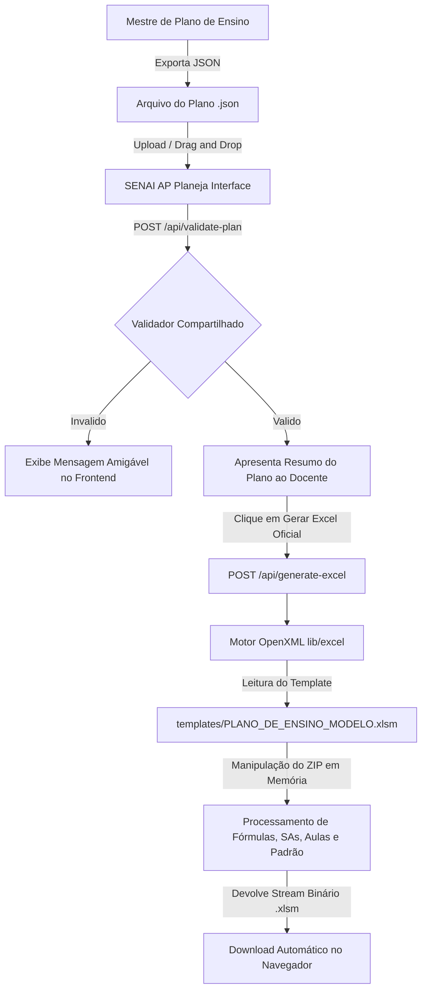
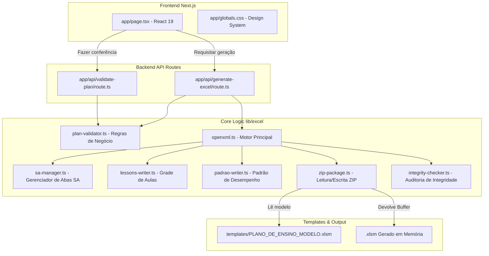

<div align="center">

  <!-- Logo placeholder: public/brand/logo.png -->
  <!--  -->

  # SENAI AP Planeja
  ### Do plano ao Excel institucional

  <p align="center">
    Aplicação web desenvolvida para transformar o Arquivo do Plano de Ensino gerado pelo Mestre de Plano em um arquivo Excel institucional do SENAI, preservando macros, fórmulas, layouts e a estrutura oficial do modelo institucional.
  </p>

  <p align="center">
    <a href="https://nextjs.org"></a>
    <a href="https://react.dev"></a>
    <a href="https://www.typescriptlang.org"></a>
    <a href="https://nodejs.org"></a>
    
  </p>

</div>

---

## 📌 Sobre o Projeto

O **SENAI AP Planeja** resolve o desafio de converter dados estruturados de planejamento pedagógico no formato de planilha oficial `.xlsm` exigido pelas instituições do SENAI.

Muitas ferramentas tradicionais de exportação destroem macros VBA, desalinham células mescladas, desconfiguram fórmulas em cadeia ou corrompem arquivos codificados em OpenXML. O **SENAI AP Planeja** opera manipulando o pacote de arquivos do Excel diretamente em memória via OpenXML, garantindo que o documento final mantenha **100% de fidelidade visual, estrutural e funcional**.

### Destaques do Sistema
* **Preservação de Macros VBA**: Mantém o arquivo de código `vbaProject.bin` original intocado.
* **Preservação de Fórmulas e Estilos**: Atualiza apenas os valores em cache (`<v>`) sem sobrescrever expressões de fórmulas (`<f>`).
* **Gerenciamento Dinâmico de Planilhas**: Adiciona ou remove abas de Situação de Aprendizagem (`SA01`, `SA02`, etc.) sincronizando a estrutura de relacionamentos do documento.
* **Preenchimento de Aulas e Padrão de Desempenho**: Preenche a grade de aulas (com validações de carga horária) e a matriz do Padrão de Desempenho (com validação de cobertura de capacidades e pesos somando 100%).
* **Interface Simples e Acessível**: Projetada para professores sem conhecimento técnico, com animação sequencial de passos, download automático e suporte a acessibilidade e movimento reduzido.

---

## 🔄 Fluxo de Funcionamento

O diagrama abaixo ilustra a jornada desde a entrada do planejamento até o download do arquivo oficial:



---

## ✨ Principais Funcionalidades

* 📤 **Upload Simples por Seleção ou Arrasta e Solta**: Suporte a drag-and-drop inteligente com feedback tátil e visual.
* 🛡️ **Validação Automática Rigorosa**: Verificação de versão do esquema, aprovações pedagógicas, compatibilidade de cargas horárias, vínculo de SAs e pesos do Padrão.
* 📊 **Resumo de Pré-visualização**: Apresentação clara de curso, unidade curricular, carga horária total, quantidade de SAs, aulas, capacidades e critérios.
* 🧩 **Ajuste Dinâmico de Situações de Aprendizagem**: Criação ou remoção física de abas no pacote Excel dependendo da quantidade de SAs do plano.
* 📅 **Grade de Aulas com Formatação Nativa**: Conversão automática de datas para números de série do Excel, preservação de estilos e quebras de linha `\n`.
* 🎯 **Matriz do Padrão de Desempenho**: Validação de cobertura completa das capacidades oficiais (técnicas e socioemocionais) e gravação de pesos decimais fracionários.
* ⚡ **Geração Sequencial Animada**: Painel visual de acompanhamento com 4 passos durante o processamento do Excel.
* 💾 **Download Inteligente e Re-download**: Download disparado automaticamente com opção de *"Baixar novamente"* sem gerar novas requisições ao servidor.
* ♿ **Acessibilidade e Desempenho**: Foco visível via teclado (`:focus-visible`), navegação sem barreiras e suporte a `prefers-reduced-motion`.

---

## 🏗️ Arquitetura Interna

O sistema é construído sobre uma arquitetura modular que desacopla a interface do usuário, as rotas de API, as regras de validação e o motor OpenXML:



---

## 🛠️ Tecnologias Utilizadas

| Categoria | Tecnologia | Versão | Descrição |
| :--- | :--- | :--- | :--- |
| **Framework Web** | [Next.js](https://nextjs.org/) | `15.2.0` | Framework React para produção com App Router |
| **Biblioteca UI** | [React](https://react.dev/) | `19.0.0` | Renderização reativa de componentes |
| **Linguagem** | [TypeScript](https://www.typescriptlang.org/) | `5.7.0` | Tipagem estática end-to-end |
| **Runtime** | [Node.js](https://nodejs.org/) | `22+` | Runtime para manipulação de arquivos e APIs |
| **Estilização** | CSS Vanilla | CSS3 | Design system customizado com glassmorphism e animações GPU |
| **Manipulação ZIP** | [PizZip](https://github.com/open-xml-templating/pizzip) | `3.3.0` | Leitura e escrita síncrona de pacotes ZIP OpenXML em memória |
| **Descompressão** | [Pako](https://github.com/nodeca/pako) | `2.1.0` | Utilitário de descompressão zlib/deflate |

---

## 📁 Estrutura do Projeto

```
gerador-excel-senai/
├── app/                        # Next.js App Router (Páginas e APIs)
│   ├── api/
│   │   ├── generate-excel/     # Endpoint POST para geração do XLSM
│   │   └── validate-plan/      # Endpoint POST para validação prévia
│   ├── globals.css             # Design System, animações e tokens CSS
│   ├── layout.tsx              # Shell base da aplicação
│   └── page.tsx                # Interface gráfica principal e estado do cliente
├── components/                 # Componentes reutilizáveis
│   └── icons.tsx               # Coleção de ícones vetoriais SVG otimizados
├── lib/
│   └── excel/                  # Motor OpenXML e validações de domínio
│       ├── cell-writer.ts      # Manipulador low-level de células OpenXML
│       ├── institutional-map.ts# Mapeamento institucional de coordenadas Excel
│       ├── integrity-checker.ts# Auditoria de integridade do pacote e fórmulas
│       ├── lessons-writer.ts   # Processador e formatador da grade de aulas
│       ├── openxml.ts          # Coordenador de montagem do pacote XLSM
│       ├── padrao-writer.ts    # Processador e validador do Padrão de Desempenho
│       ├── plan-validator.ts   # Validador de esquema e regras de negócio
│       ├── sa-manager.ts       # Escalonador dinâmico de abas SA
│       ├── workbook-map.ts     # Mapeamento de relacionamentos e abas ativas
│       └── zip-package.ts      # Leitor e gravador de arquivos PizZip
├── public/                     # Ativos estáticos públicos
├── scripts/                    # Scripts de teste automatizado e auditoria
│   ├── run-dynamic-sa-test.ts  # Teste de escalonamento dinâmico de SAs
│   ├── run-e2e-test.ts         # Teste ponta a ponta completo
│   ├── run-headers-test.ts     # Teste de cabeçalhos do Plano de Ensino
│   ├── run-lessons-test.ts     # Teste da grade de aulas
│   ├── run-openxml-test.ts     # Teste base de preservação OpenXML
│   ├── run-padrao-test.ts      # Teste do Padrão de Desempenho (Positivos e Negativos)
│   └── test-api-routes.ts      # Teste de integração das rotas de API
├── templates/
│   └── PLANO_DE_ENSINO_MODELO.xlsm # Modelo oficial institucional do SENAI
├── tests/
│   └── fixtures/
│       └── plano-completo.json # Fixture completo para testes de integração
├── package.json
└── tsconfig.json
```

---

## 🚀 Como Executar Localmente

### Pré-requisitos
* **Node.js**: Versão `18.x` ou superior (recomendado `22.x`).
* **npm**: Versão `9.x` ou superior.

### Passo a Passo

1. **Clonar o repositório**:
   ```bash
   git clone https://github.com/WeslynFigueiredo/gerador-excel-senai-inicial.git
   cd gerador-excel-senai-inicial
   ```

2. **Instalar as dependências**:
   ```bash
   npm install
   ```

3. **Iniciar o servidor de desenvolvimento**:
   ```bash
   npm run dev
   ```

4. **Acessar a aplicação**:
   Abra o navegador em [http://localhost:3000](http://localhost:3000).

5. **Executar o build de produção**:
   ```bash
   npm run build
   npm start
   ```

---

## ⚙️ Fluxo Técnico de Geração do Excel

A manipulação do modelo institucional `.xlsm` utiliza a especificação OpenXML (ISO/IEC 29500):

1. **Carregamento em Memória**: O modelo oficial `PLANO_DE_ENSINO_MODELO.xlsm` é lido do disco como um Buffer de bytes e descompactado sintonizadamente usando `PizZip`.
2. **Isolamento do Template Original**: O arquivo original em disco **nunca é modificado ou sobrescrito**. Toda mutação ocorre exclusivamente na instância carregada em RAM.
3. **Mutação Cirúrgica em XMLs**:
   * `xl/worksheets/sheet1.xml` (`Plano de Ensino`): Atualização das células de cabeçalho.
   * `xl/worksheets/sheet6.xml..sheet10.xml` (`SAs`): Ajuste de abas ativas, adição/remoção de referências no `xl/workbook.xml` e `xl/_rels/workbook.xml.rels`, atualização dos valores em cache (`<v>`) e gravação da grade de aulas (linhas 13 a 54).
   * `xl/worksheets/sheet11.xml` (`Padrão de Desempenho`): Preenchimento das linhas 5 a 79 com os critérios, descritores N0–N4 e pesos.
4. **Reconstrução do Pacote**: O pacote ZIP é compactado e exportado como um Buffer binário com cabeçalhos HTTP `Content-Type: application/vnd.ms-excel.sheet.macroEnabled.12`.

---

## 🔒 Segurança e Integridade do Modelo XLSM

Para garantir que o arquivo baixado abra perfeitamente no Excel sem exibir mensagens de reparo ou corrupção, o motor preserva integralmente:

* `xl/vbaProject.bin`: Código binário contendo as macros VBA institucionais.
* `xl/drawings/`: Desenhos vetoriais e caixas de diálogo.
* `xl/vmlDrawing*.vml`: Controles de botões e formas VML.
* `xl/media/`: Imagens e logotipos institucionais embutidos no modelo.
* `xl/printerSettings/`: Configurações de página e impressão originais.
* `<f>` (Fórmulas): Expressões matemáticas (como `=SUM(C13:C54)` na célula `L6`) permanecem intactas.

> **Nota para o Docente**: Ao abrir o arquivo `.xlsm` baixado no Microsoft Excel, a barra amarela de proteção de segurança (*"Aviso de Segurança: As macros foram desabilitadas"*) poderá ser exibida pelo Excel devido às configurações locais da máquina. Isso é o comportamento normal do Excel para arquivos com macros baixados da web. As macros permanecem 100% ativas e preservadas.

---

## 📏 Regras de Negócio e Validações

Antes de iniciar a montagem do documento, o plano passa pelas seguintes checagens:

| Regra | Condição de Validação | Mensagem de Retorno ao Usuário |
| :--- | :--- | :--- |
| **Aprovação do Plano** | `status.plano_aprovado === true` | *O Plano de Ensino precisa estar aprovado antes da geração do Excel.* |
| **Aprovação do Padrão** | `status.padrao_desempenho_aprovado === true` | *O Padrão de Desempenho precisa estar aprovado antes da geração do Excel.* |
| **Soma dos Pesos** | $\sum \text{pesos} = 100\%$ | *Os pesos do Padrão de Desempenho somam X%. O total precisa ser exatamente 100%.* |
| **Cobertura de Capacidades** | Todas as capacidades oficiais devem estar no Padrão | *A capacidade oficial abaixo não está representada no Padrão de Desempenho: ...* |
| **Carga Horária das SAs** | $\sum \text{CH}(aulas) = \text{CH}(SA)$ | *Divergência na carga horária da SAxx: carga declarada = Xh; soma das aulas = Yh.* |
| **Vínculo das SAs** | Todas as `sa_ids` dos critérios devem existir no plano | *O critério X está vinculado à SAxx, mas ela não existe nas Situações de Aprendizagem do plano.* |

---

## ⚠️ Limitações Atuais

1. **Capacidade por SA**: O modelo institucional comporta até **21 aulas por SA** (slots de 2 linhas entre as linhas 13 e 54). Planos com mais de 21 aulas por SA requerem expansão do modelo.
2. **Capacidade do Padrão de Desempenho**: O modelo institucional comporta até **75 critérios** (linhas 5 a 79).
3. **Evidência Relacionada**: O campo `evidencia_relacionada` é preservado no modelo de dados estruturado, porém não é impresso em coluna própria do Excel porque o modelo institucional da aba *Padrão de Desempenho* não possui um campo dedicado para este dado.

---

## 🧪 Testes Automatizados

O projeto inclui uma suíte de testes de integração executáveis diretamente via terminal:

```bash
# Teste base de manipulação OpenXML
npm run test:openxml

# Teste de cabeçalhos e fórmulas do Plano de Ensino
npm run test:headers

# Teste de escalonamento dinâmico de abas SA
npm run test:sa

# Teste da grade de aulas e formatação de datas/textos
node --experimental-strip-types scripts/run-lessons-test.ts

# Teste completo do Padrão de Desempenho (Positivos e Negativos)
node --experimental-strip-types scripts/run-padrao-test.ts

# Teste de integração das rotas de API
node --experimental-strip-types scripts/test-api-routes.ts

# Teste ponta a ponta (E2E) completo
node --experimental-strip-types scripts/run-e2e-test.ts
```

---

## ☁️ Deploy

O projeto é 100% compatível com ambientes Node.js e preparado para hospedagem em plataformas como **Render**, **Vercel** ou **AWS**:

* **Configuração de Runtime na API**: `export const runtime = "nodejs";`
* **URL de Produção**: *em configuração*

---

## 🛣️ Roadmap

- [x] Leitura e validação de arquivos JSON do Mestre de Plano
- [x] Preenchimento dos cabeçalhos do Plano de Ensino
- [x] Gerenciamento dinâmico de abas SA (criação e remoção limpa)
- [x] Preenchimento da grade de aulas com formatação de data e carga horária
- [x] Preenchimento da matriz do Padrão de Desempenho e validação de pesos
- [x] API de geração binária em memória (`/api/generate-excel`)
- [x] Interface reativa com feedback de progresso e acessibilidade
- [ ] Publicação em ambiente de produção com domínio institucional
- [ ] Integração direta via API com a plataforma Mestre de Plano de Ensino
- [ ] Suporte a novos modelos institucionais estaduais do SENAI

---

## 🏢 Uso Institucional

Projeto desenvolvido como solução de apoio ao fluxo de planejamento docente e geração automatizada de documentos institucionais do SENAI.

---

## 👤 Autor e Manutenção

Desenvolvido e mantido por **Weslyn Figueiredo**.

* **GitHub**: [@WeslynFigueiredo](https://github.com/WeslynFigueiredo)
